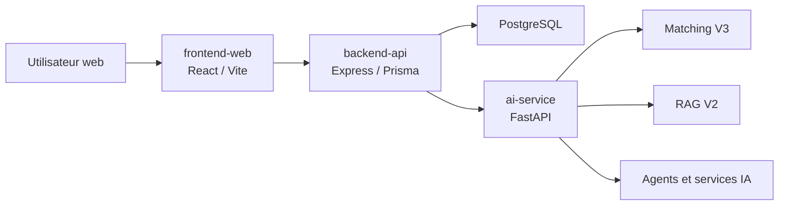

# Vue d'ensemble

## Contexte

SmartIntern AI est une plateforme intelligente de gestion de stages et de matching entre étudiants et entreprises. Le projet répond à une difficulté fréquente : les étudiants ne savent pas toujours quelles offres correspondent réellement à leur profil, tandis que les entreprises reçoivent des candidatures difficiles à comparer objectivement.

La plateforme combine une application web, une API backend, une base PostgreSQL et un service IA dédié. L'objectif est de rendre le processus de stage plus lisible, plus rapide et plus explicable.

## Problématique

Un matching simple basé sur quelques mots-clés ne suffit pas pour évaluer un profil étudiant. Il faut prendre en compte :

- les compétences détectées dans le CV ;
- les compétences obligatoires et optionnelles d'une offre ;
- la qualité des preuves dans le CV ;
- les compétences manquantes ;
- le niveau de confiance de l'analyse ;
- la clarté de l'offre de stage.

## Solution proposée

SmartIntern AI propose :

- un espace étudiant pour gérer le profil, le CV, les offres et les candidatures ;
- un espace entreprise pour gérer les offres et suivre les candidatures ;
- un espace admin pour superviser les utilisateurs et entreprises ;
- un moteur IA avec matching V3, IA explicable, assistant carrière, génération de lettre, RAG et orchestration.

## Utilisateurs cibles

| Rôle | Objectif principal |
| --- | --- |
| Étudiant | Trouver une offre adaptée, comprendre son score et améliorer son dossier |
| Entreprise | Publier des offres plus claires et identifier les candidats pertinents |
| Administrateur | Superviser la plateforme et contrôler les comptes |

## Valeur ajoutée IA

La partie IA ne se limite pas à produire un score. Elle explique pourquoi le score est obtenu avec :

- `Evidence Checker` : qualité des preuves par compétence ;
- `Career Signal Map` : forces et faiblesses par domaine technique ;
- `Decision Trace` : trace lisible de la décision IA ;
- `Skill Gap Simulator` : estimation de l'impact d'une compétence à travailler ;
- `Offer Quality Analyzer` : qualité et clarté d'une offre ;
- `Career Assistant V2` : plan d'action professionnel ;
- `Motivation Letter V2` : lettre basée sur les preuves réelles ;
- `RAG V2` : contexte documentaire avec citations ;
- `Orchestrator V2` : coordination des services IA.

## Architecture générale

## État actuel

Le backend, le frontend web et le service IA sont développés. Les dossiers `mobile-app` et `devops` existent mais restent principalement des espaces de préparation pour les futures étapes. La documentation principale est centralisée dans `docs/`.

## Prochaines étapes

- compléter la partie mobile ;
- renforcer le déploiement Docker/CI ;
- ajouter des tests E2E navigateur ;
- optimiser les performances frontend ;
- améliorer le monitoring et les métriques de qualité IA.

