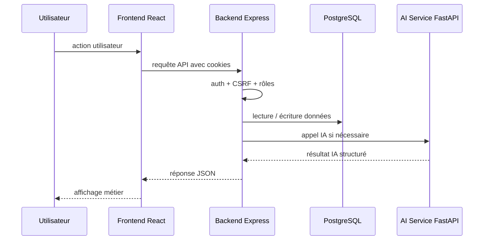
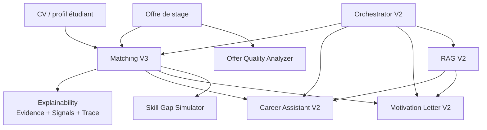

# Architecture technique

## Vue globale

SmartIntern AI est organisé en plusieurs modules séparés :

- `frontend-web` : interface React / Vite ;
- `backend-api` : API Express, sécurité, rôles, base de données, proxy IA ;
- `ai-service` : service FastAPI pour les traitements IA ;
- `database` : documentation base de données ;
- `docs` : documentation projet ;
- `mobile-app` et `devops` : dossiers présents, à compléter dans les prochaines étapes.

## Flux principal

## Responsabilités

| Module | Responsabilité |
| --- | --- |
| Frontend | UI, formulaires, routes protégées, affichage IA |
| Backend | Auth, rôles, validations, persistance, proxy IA |
| PostgreSQL | Stockage utilisateurs, offres, CV, candidatures, résultats |
| AI-service | Matching, RAG, génération, simulation, analyse |

## Authentification

Le backend utilise un JWT stocké dans un cookie HttpOnly. Le frontend ne lit pas le JWT. La session est restaurée via `GET /api/auth/me`. Les requêtes mutantes utilisent une protection CSRF double-submit avec `GET /api/auth/csrf-token`.

## Flux IA

## Flux candidature

1. L'étudiant consulte une offre publiée.
2. Le backend récupère les données étudiant, CV et offre.
3. Le matching IA peut être calculé.
4. L'étudiant postule via `POST /api/offers/:offerId/apply`.
5. Une candidature est enregistrée avec un statut.
6. L'entreprise consulte les candidatures reçues.

## Limites actuelles

- pas encore de pipeline DevOps complet dans le dossier `devops` ;
- pas encore d'application mobile développée dans `mobile-app` ;
- les tests E2E navigateur restent à compléter ;
- le stockage vectoriel utilise le modèle `VectorDocument` avec `embeddingJson`.

