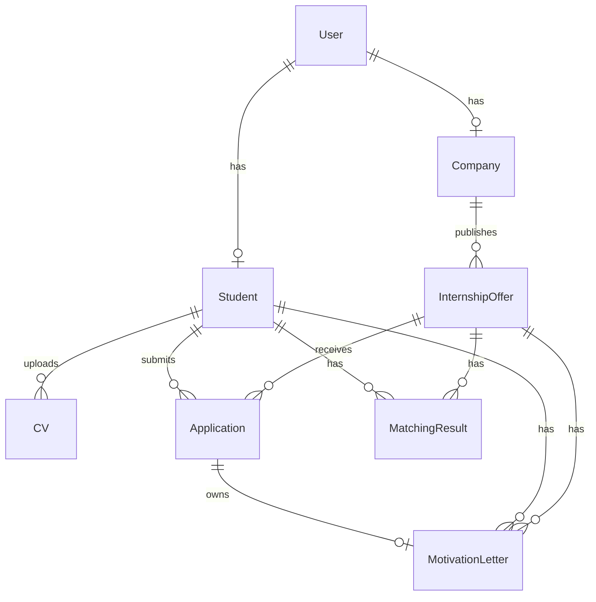

# Modèle de données

Le modèle de données est défini dans `backend-api/prisma/schema.prisma`.

## Enums

| Enum | Valeurs |
| --- | --- |
| `UserRole` | `STUDENT`, `COMPANY`, `ADMIN` |
| `CompanyStatus` | `PENDING`, `VALIDATED`, `REJECTED`, `SUSPENDED` |
| `OfferStatus` | `DRAFT`, `PUBLISHED`, `ARCHIVED`, `CLOSED` |
| `ApplicationStatus` | `SENT`, `PENDING`, `ACCEPTED`, `REJECTED`, `CANCELLED` |
| `VectorOwnerType` | `CV`, `OFFER`, `CAREER_ADVICE`, `MOTIVATION_LETTER` |

## Modèles

### User

Représente un compte utilisateur.

Champs importants :

- `email` unique ;
- `passwordHash` ;
- `role` ;
- `isActive` ;
- `resetPasswordToken` et `resetPasswordExpires`.

Relations :

- un `User` peut avoir un `Student` ;
- un `User` peut avoir une `Company`.

### Student

Profil étudiant lié à un utilisateur.

Champs importants :

- téléphone ;
- localisation ;
- niveau d'études ;
- poste cible ;
- bio ;
- disponibilité.

Relations :

- candidatures ;
- CV ;
- résultats de matching ;
- lettres de motivation.

### Company

Profil entreprise lié à un utilisateur.

Champs importants :

- `companyName` ;
- secteur ;
- description ;
- site web ;
- adresse ;
- statut.

Relation :

- une entreprise possède plusieurs offres.

### InternshipOffer

Offre de stage publiée ou gérée par une entreprise.

Champs importants :

- titre ;
- description ;
- localisation ;
- durée ;
- date de début ;
- compétences requises JSON ;
- compétences optionnelles JSON ;
- statut.

Relations :

- candidatures ;
- résultats de matching ;
- lettres de motivation.

### Application

Candidature d'un étudiant à une offre.

Champs importants :

- étudiant ;
- offre ;
- statut ;
- message ;
- score de compatibilité ;
- date de candidature.

Contrainte :

- un étudiant ne peut postuler qu'une fois à la même offre.

### CV

Document CV d'un étudiant.

Champs importants :

- nom du fichier ;
- URL locale ;
- type ;
- taille ;
- texte extrait ;
- analyse IA JSON ;
- date d'upload.

### MatchingResult

Résultat de matching entre un étudiant et une offre.

Champs importants :

- score ;
- compétences matchées JSON ;
- compétences manquantes JSON ;
- compétences optionnelles matchées JSON ;
- explication.

Contrainte :

- un résultat unique par couple étudiant/offre.

### MotivationLetter

Lettre de motivation générée ou modifiée.

Champs importants :

- candidature ;
- étudiant ;
- offre ;
- ton ;
- contenu ;
- indicateur IA ;
- dates.

### VectorDocument

Document vectoriel pour le RAG.

Champs importants :

- `ownerType` ;
- `ownerId` ;
- titre ;
- contenu ;
- `embeddingJson` ;
- métadonnées JSON.

## Diagramme ER simplifié

