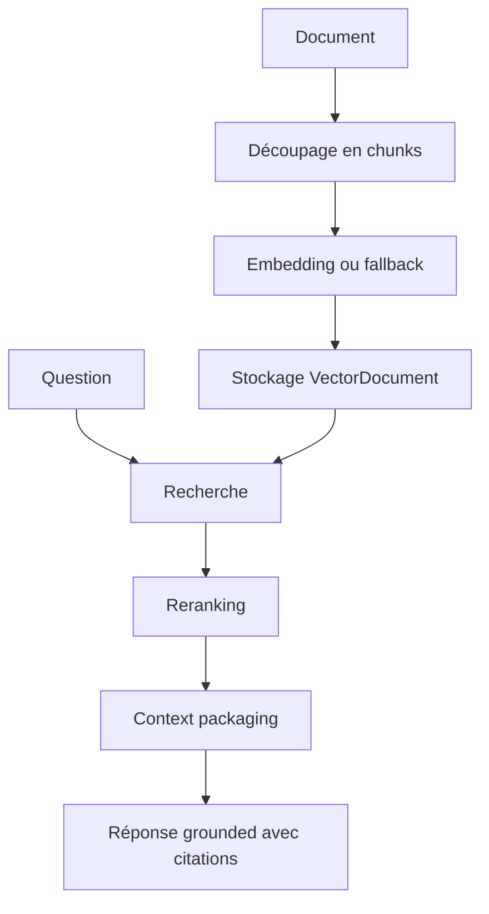
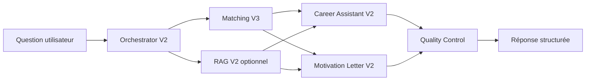

# RAG V2 et Orchestration

## RAG V2

Le RAG V2 ajoute une couche documentaire à SmartIntern AI. Il permet d'utiliser des documents indexés comme contexte.

## Documents concernés

Le modèle `VectorDocument` supporte les types :

- `CV` ;
- `OFFER` ;
- `CAREER_ADVICE` ;
- `MOTIVATION_LETTER`.

Chaque document contient :

- un propriétaire ;
- un titre ;
- un contenu ;
- un embedding JSON ;
- des métadonnées.

## Pipeline RAG

## Endpoints RAG ai-service

- `/ai/rag/embed`
- `/ai/rag/chunk`
- `/ai/rag/search-demo`
- `/ai/rag/answer`
- `/ai/rag/v2/index-document`
- `/ai/rag/v2/embed`
- `/ai/rag/v2/chunk`
- `/ai/rag/v2/retrieve`
- `/ai/rag/v2/answer`

## Endpoints RAG backend

- `POST /api/rag/search`
- `POST /api/rag/ask`
- `POST /api/rag/reindex`
- `POST /api/rag/reindex/:ownerType/:ownerId`
- `GET /api/rag/documents`
- `GET /api/rag/documents/:id`

Les endpoints de documents et reindex sont réservés à `ADMIN`.

## Orchestrator V2

L'Orchestrator V2 centralise la coordination des services IA.

Il peut :

- détecter ou normaliser un intent ;
- construire un plan d'exécution ;
- réutiliser des résultats déjà fournis ;
- appeler Matching V3 ;
- enrichir avec RAG ;
- appeler Career Assistant V2 ;
- appeler Motivation Letter V2 ;
- lancer un quality control global.

## Flux orchestré

## Principes importants

- RAG enrichit, mais ne remplace pas le Matching V3.
- Si RAG est indisponible, l'orchestrateur doit continuer si possible.
- Les réponses doivent inclure des warnings quand les données sont insuffisantes.
- La génération ne doit pas inventer de compétences ou de projets.

